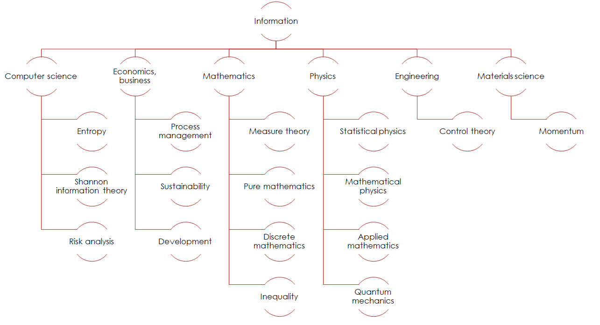

## Introduction and motivation

The universe is characterized by a multitude of connections between its parts and this property can be observed at all levels and in all sectors of knowledge. It seems that there are very few elements whose connections with the rest of reality are not known, that is, elements that appear completely disconnected. Artists and scientists in every era have grasped new connections and better understood the already known ones. However, it rarely happens that elements considered connected, then turn out to be completely independent: the entire Western and Eastern thought (the thought of all humanity) has searched and is constantly searching for new connections. For the first time in human history one begins to perceive a sort of unity, perhaps already present in ancient thought, which was then lost with the progressive specialization of knowledge in recent centuries.
Arguments not very different from this one have slowly led us to think that some of the principles on which human thought and knowledge are built are in fact principles with which nature operates and manifests itself. Speaking in informal terms (the formal treatment will be proposed later) it is possible to identify a fundamental opposition that can be found both in the arts and in science. In physical terms it declines in the problem of locality/non-locality of phenomena and theories.
In the context of quantum mechanics, non-locality has taken on a particular meaning that we will analyze later. However it is interesting to note that the theories of classical mechanics, assuming the speed of light as an infinite speed, represent a type of non-local theory since the time elapsed between a cause and its effect is exactly 0. Let consider Newton's theory of gravity: if the Sun disappeared at this very moment, at exactly the same instant the Earth would stop rotating around its star and will move in a straight line thus moving away from the solar system which would instantly begin to disintegrate. More recent experimental results and more precise theoretical descriptions motivated by new discoveries starting from Maxwell's electromagnetic theory, have shown that any information can only travel at the speed of light in vacuum $$c$$. In the previous example, if the Sun disappeared at this very moment, Earth would begin to abandon its orbit only when the information "the Sun has disappeared" had reached it and since the information can only travel at $$c$$ and since $$c$$ is not infinite then the lapse of time between the disappearance of the Sun and the modification of the trajectory of the Earth will be greather than 0. In these terms, in modern physics, we speak of local theory only in the moment in which such a time elapses between a cause and an effect so that at least a beam of light starting from the cause can reach the effect.
We speak of non-local theory when there are systems connected in such a way that the modification of one of the two elements instantly causes the modification of the element connected to it. Quantum mechanics is a non-local theory. BUT this in no way violates the fundamental principles of physics since when non-local phenomena occur, no information has traveled from one element to another. Unlike general relativity, a non-local connection is not informational. Since there is no information involved in the connection, its speed is not required to be less or equal that $$c$$. Since there is no information involved in the connection, it is not required that the principle of locality be respected and therefore the constraint that the signal must travel at the maximum speed of light is dropped. At this point the locality/non-locality problem has become an information/non-information type problem on which we will dwell at length.
Consider the following table:

|    Principle    |  Property   |           Justification            |
| :-------------: | :---------: | :--------------------------------: |
|    Locality     | $$v\leq c$$ |       Definition of locality       |
|   Information   | $$v\leq c$$ |         General relativity         |
|  Non-locality   |   $$v>c$$   | Negation of definition of locality |
| Non-information |   $$v>c$$   |   Negation of General relativity   |

Hence,

| Locality status |  Property   | Informative status |
| :-------------: | :---------: | :----------------: |
|    Locality     | $$v\leq c$$ |    Information     |
|  Non-locality   |   $$v>c$$   |  Non-information   |

## Information

Information is a key concept of knowledge whose general definition, shared by all, is currently an open problem. Each discipline adopts a particular definition and allows to compare systems and phenomena. Information is particularly interesting because it allows eliminating the problem of measurement in order to describe the phenomena not on the basis of their quantitative but qualitative description.

Consider the following interpretation of the information. Classical mechanics, developed in the context of the enlightenment, deterministic and mechanistic western culture, has become the symbol of the predictive accuracy of theories. The "broken dream" of classical mechanics was to describe reality by predicting with absolute certainty the evolution of a system knowing exactly all its previous states. Statistical mechanics and thermodynamics have taught that describing complex systems formed by many bodies is a problem that cannot be solved exactly in the general form. Therefore classical mechanics applied to a multitude of particles predicts the average behaviour of the system as a whole but avoids describing each component individually. Frequently, the general solutions are numerical or simulations produced through a large computing power: it is possible to simulate the behavior of a complex system but not to solve it analytically.

Proceeding along this road it became clear that, besides being impossible to analytically solve the behavior of a complex system, it is impossible to obtain a complete description of the behavior of a system since it is not known how many parameters are needed to describe it completely [1]. This is why it is necessary to introduce the concept of information [3]. A research conducted on ETO [2] prove the relevance of the concept of information in the scientific world: the following figure represents the results of the survey. [4][5][6][7] In particular we want to draw attention to a particular definition of information called Fisher Information [8] which brings the statistical problem closer to the world of algebra and non-Euclidean geometries. At this point begins the research that transversally merges different disciplines. From algebra to atomic physics (statistical mechanics and quantum mechanics) up to general relativity.

## Research line

## Bibliograpy

1. Nagy, Á. Int J Quantum Chem 2022, 122( 8), e26679. https://doi.org/10.1002/qua.26679.
2. Sciencemap.eto.tech, "ETO Map of Science.", https://sciencemap.eto.tech/.
3. Gentle, James E. "Theory of statistics." George Mason University (2013).
4. Sciencemap.eto.tech, "ETO Map of Science.", https://sciencemap.eto.tech/cluster/?cluster_id=86103.
5. Sciencemap.eto.tech, "ETO Map of Science.", https://sciencemap.eto.tech/cluster/?cluster_id=60834.
6. Sciencemap.eto.tech, "ETO Map of Science.", https://sciencemap.eto.tech/cluster/?cluster_id=57652.
7. Sciencemap.eto.tech, "ETO Map of Science.", https://sciencemap.eto.tech/cluster/?cluster_id=35006.
8. Frieden, B. Roy. "Physics from Fisher information: a unification." (2000): 1064-1065.
