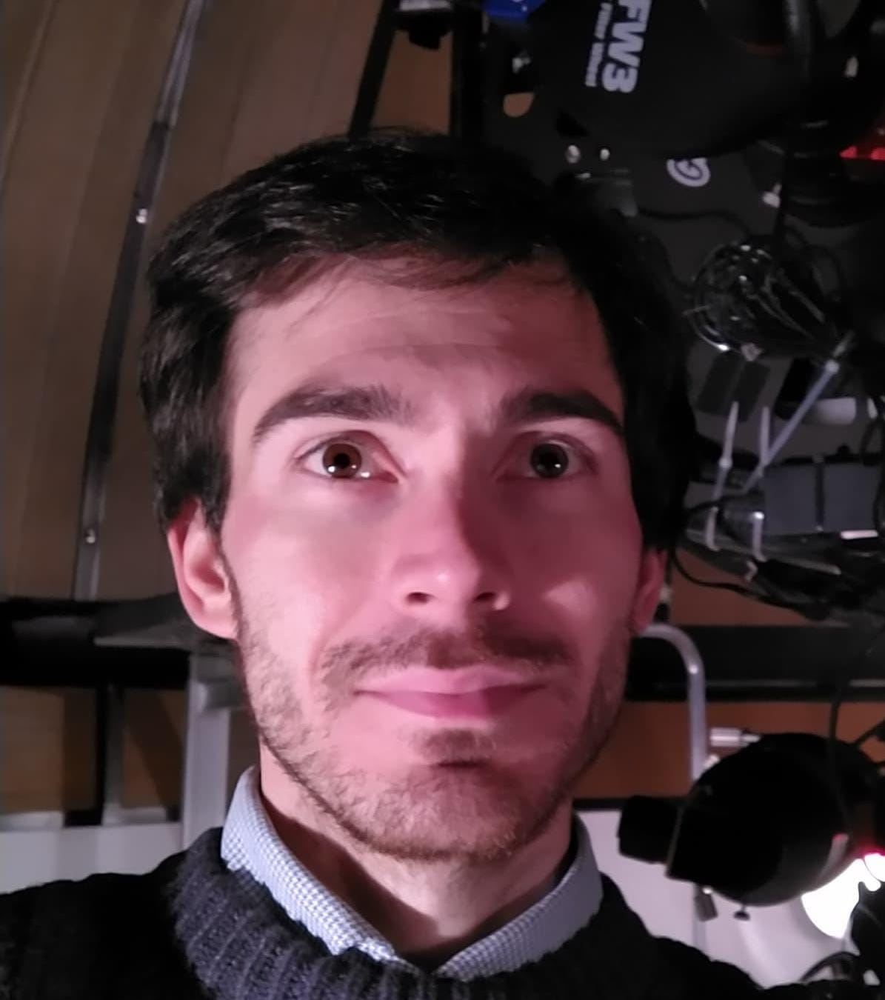

  
  
  
  
  
  
  

Good evening, I am Riccardo Gatti. From a young age, I have nurtured a deep passion for science, entrepreneurship, and knowledge dissemination, convinced that knowledge is the driving force behind positive change in society. During my years at Liceo Scientifico Belfiore, I began dedicating myself to research and the spread of ideas, exchanging correspondence and studying in depth alongside great minds such as Bruno Bertotti—experiences that profoundly shaped me.  

At 23, I embraced professional independence, bringing my life project to fruition, which led me to publish research in specialized scientific journals (MDPI, Wolfram Research, and the Encyclopedia of Integer Sequences). This path allowed me to co-found EaziU at the age of 25, a startup that leverages technology to serve research, while also collaborating with prestigious institutions such as INBB to explore information theory applied to biology.  

My entrepreneurial and academic experiences merge into my vision of a world where scientific dissemination not only inspires new generations but also fosters a concrete exchange between the school, university, and industry sectors. In this perspective, I have invested in projects that promote knowledge dissemination and research, as well as initiatives aimed at bridging the gap between research and the business sector, aware that the spread of knowledge has an extraordinary impact on the economy, society, and education.  

In 2024, I collaborated as a formalist mathematical researcher with the team of the REXASI-PRO project (REliable & eXplainable Swarm Intelligence for People with Reduced Mobility), supported by European community funds. This project aimed at engineering AI-based technologies to improve mobility, thus combining innovation, technology, and inclusion. At 26, to give a name and direction to all my activities—especially those yet to come—I founded OneBeWhole, an entity dedicated to valuing and disseminating new disciplines emerging from the challenges of our time. At the same time, I actively participate in events, courses, and training activities aimed at both the general public and specialists, with the goal of conveying the enthusiasm and depth of scientific research.  

For me, every project, publication, and event is a fundamental piece in the great mosaic of knowledge, which nurtures the future of our society. My mission is to contribute to a culture of verification and accuracy of information, because in a world where artificial intelligence generates countless data, only rigorous control can ensure that knowledge remains a tool for growth and collective responsibility.  

With dedication and passion, I continue to pursue this path, convinced that the advancement of science and technology, together with the sharing of knowledge, can illuminate the way toward a better future for all.

  <i>All our knowledge begins with the
   senses, proceeds then to the 
   understanding, and ends with reason.
    There is nothing higher than reason.</i>
    Immanuel Kant, <i>Critique of Pure Reason</i>

**Senior Researcher**: My research in mathematics spans from number theory to Riemannian manifolds, particularly in statistical manifolds and information theory. While I have a deep passion for physics and computer science, I see mathematics as the art of ideas, an exploration of the logic of thought that enables us to describe, understand, and communicate human knowledge.

**Co-Founder & Technical Director**: As the technical director of the company I co-founded, I focus on integrating technologies and simplifying technological processes by shifting complexity from the user experience to the development phase. True technological progress lies in genuine process simplification, ensuring that complexity serves development rather than obstructing usability.

**Philosophy**: Let the one be the whole, the Universe act, and the higher will be done. She knows the right way.

### Research sites

* [Wolfram Function Repository](https://resources.wolframcloud.com/publishers/resources?PublisherID=riccardogatti)
* [OEIS](https://oeis.org/search?q=author:_riccardo+gatti_)
* [ScienceOpen](https://www.scienceopen.com/search#author/281f0b5f-5c02-4ec3-97c3-81c8a8a3be57)
* [ORCID](https://orcid.org/0000-0002-3554-4126)
* [SciProfiles](https://sciprofiles.com/profile/974059)
